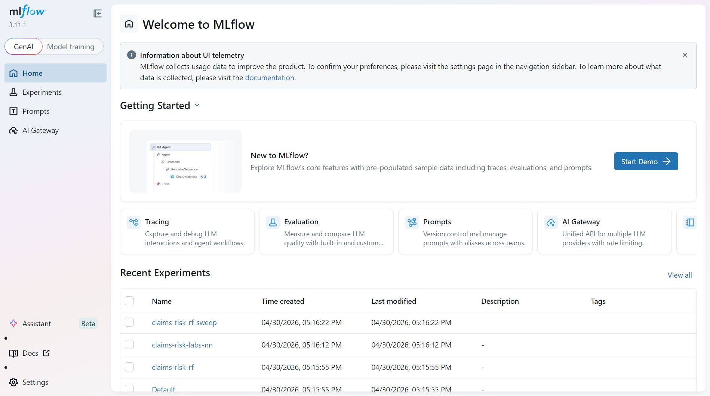

# Multi-Agent Claims Risk Orchestrator

[](https://github.com/jagadeesh-profile/multi-agent-claims-risk-orchestrator/actions/workflows/ci.yml)

A learning-oriented multi-agent system on Google Vertex AI ADK that ingests heterogeneous claims data — structured insurance claims, semi-structured lab panels, and unstructured discharge notes — and produces a routed, explainable decision with measured latency.

> **Quick links:** [Architecture diagram](docs/architecture.svg) · [Model card](docs/model_card.md) · [Data card](docs/data_card.md) · [Status / what's verified](docs/STATUS.md) · [LinkedIn launch kit](docs/LAUNCH_KIT.md)

## Current baseline

Fresh baseline from 2026-04-30:

| Area | Result |
|------|--------|
| Offline tests | 39 passed |
| Claims RF | AUC 0.9613, Brier 0.0095 |
| Labs NN | AUC 0.9403, Brier 0.0734 |
| Live eval | A/B/C all 100% decision agreement across 3 runs |
| Expected actions | A `AUTO_APPROVE`, B `FLAG_FOR_AUDIT`, C `ESCALATE_TO_HUMAN` |



This is a proof of concept built to explore the four ADK agent primitives (`LlmAgent`, `SequentialAgent`, `ParallelAgent`, `LoopAgent`) on a domain that justifies using all of them. The data is synthetic-but-shape-realistic so the project can run end-to-end on a laptop without HIPAA-protected inputs. **Treat the architecture as the artifact, not the numbers.**

## Why this project exists

A static `if/elif` pipeline cannot handle real claims data. Sources arrive at different cadences with different schemas; some panels go missing; signals frequently conflict (a Random Forest screams "fraud" on a $24k claim, but the discharge note explains why the cost was legitimate). The system needs four capabilities that classical ML alone does not provide:

1. Dynamic routing based on which inputs are present
2. Three model types running concurrently (Random Forest + TensorFlow NN + LLM)
3. Context-aware fusion that weights conflicting signals — not averages them
4. A bounded review-and-refine loop that escalates to a human when confidence is too low

All four are implemented as ADK primitives — `LlmAgent`, `SequentialAgent`, `ParallelAgent`, `LoopAgent`. The project also ships a small custom subclass (`RoutedParallelAgent`) that lets the Router actually skip specialists rather than fanning out unconditionally, plus a `LoopExitChecker` that exits the review loop the moment validation passes (or escalates).

## ML / MLOps surface

The project is intentionally cross-cut: agentic orchestration *plus* a real ML stack. What's wired up:

- **Two production-shape models.** Random Forest (scikit-learn Pipeline + ColumnTransformer) and a TensorFlow Keras DNN, with bundled scaler.
- **Calibration-aware evaluation.** AUC alone hides miscalibrated models, so training reports Brier score, log loss, and a 10-bin reliability curve.
- **Cross-validation.** 5-fold stratified CV on the RF gives an AUC variance estimate, not a single optimistic holdout number.
- **Hyperparameter optimization.** `python -m src.tune_claims_rf` runs an Optuna TPE sweep, replaces hand-tuning with a real search, logs every trial.
- **Experiment tracking.** Every train + tune run is logged to MLflow under `./mlruns`. Browse with `mlflow ui --backend-store-uri ./mlruns`. Optional dependency — training works without MLflow installed.
- **Explainability.** The ClaimsAgent tool returns top-3 SHAP-attributed features per prediction, so the LLM can include the actual drivers in its rationale.
- **Model + data cards.** `docs/model_card.md` and `docs/data_card.md` document intended use, evaluation, drift considerations, and limitations — Google / Hugging Face standard documentation.

## Architecture

```
RootPipeline (SequentialAgent)
  ├─ RouterAgent              decides which specialists to invoke
  ├─ SpecialistTeam (ParallelAgent)
  │    ├─ ClaimsAgent         calls Random Forest model
  │    ├─ LabsAgent           calls TensorFlow neural network
  │    └─ NotesAgent          extracts structured signals from free text via Gemini
  ├─ FusionAgent              context-aware weighting, not averaging
  ├─ ReviewLoop (LoopAgent, max 3, early-exit aware)
  │    ├─ ReviewerAgent       validates against safety rules
  │    ├─ LoopExitChecker     escalates out of the loop on pass/escalate
  │    └─ RefinerAgent        rewrites if rules fail (skipped on early exit)
  └─ ActionAgent              emits final JSON + writes audit log
```

## Output contract

```json
{
  "patient_id": "P_ROBERT",
  "risk_level": "HIGH",
  "anomaly_score": 0.74,
  "confidence": 0.88,
  "recommended_action": "FLAG_FOR_AUDIT",
  "reasoning": "RF flagged cost anomaly; notes contradict billing pattern; fusion down-weighted labs",
  "audit_trail": "2 reviewer pass(es), all sources logged"
}
```

`recommended_action` is one of `AUTO_APPROVE`, `ROUTINE_FOLLOWUP`, `FLAG_FOR_AUDIT`, `ESCALATE_TO_HUMAN` — each maps to a different downstream system (auto-payment, care manager queue, SIU audit ticket, human review).

## Input and output paths

There are three ways to feed input into the project:

| Use case | Where input goes | Command / UI |
|----------|------------------|--------------|
| Run built-in demos | `src/sample_cases.py` | `python -m src.main --case A` |
| Run a new patient case | Any JSON file you create, for example `inputs/case_robert.json` | `python -m src.main --input inputs/case_robert.json` |
| Retrain models on generated data | `data/claims.csv`, `data/labs.csv`, `data/notes.csv` | `python -m src.generate_data --n 2000 --out data` |
| Use the dashboard | Paste custom JSON into Streamlit | `streamlit run streamlit_app.py` |

Custom patient-case JSON shape:

```json
{
  "patient_id": "P_CUSTOM",
  "claim": {
    "cost_usd": 12000.0,
    "procedure_count": 3,
    "los_days": 2,
    "age": 61,
    "drg_code": "470"
  },
  "labs": {
    "a1c": 7.2,
    "ldl": 135,
    "egfr": 68,
    "troponin": 0.02
  },
  "notes": "Short discharge or claim-review note goes here."
}
```

Set `"labs": null` when labs are missing. The router will skip the labs specialist for that case.

Outputs are written here:

| Output | Saved location | Created by |
|--------|----------------|------------|
| Final CLI decision JSON | `outputs/decisions/<patient_id>_<timestamp>.json` | `python -m src.main ...` |
| Audit log JSONL | `logs/audit.jsonl` | ActionAgent audit tool |
| Eval report | `eval/results.json`, `eval/results.md` | `python -m eval.run_eval --runs 3` |
| Model metrics | `models/claims_rf_metrics.json`, `models/labs_nn_metrics.json` | training scripts |
| RF tuning result | `models/claims_rf_best_params.json` | `python -m src.tune_claims_rf --trials 30` |
| MLflow runs | `mlruns/` | training and tuning scripts |

The raw generated CSVs, trained model binaries, local audit logs, `.env`, `.venv`, `mlruns/`, and CLI decision outputs are gitignored by default.

## Quick start

```bash
# 1. environment
python -m venv .venv && source .venv/bin/activate
pip install -r requirements.txt
cp .env.example .env  # then fill in GOOGLE_API_KEY

# 2. data + models (one-time, ~3 minutes)
python -m src.generate_data
python -m src.train_claims_rf
python -m src.train_labs_nn

# 3. run a sample case
python -m src.main --case A   # routine
python -m src.main --case B   # fraud audit path
python -m src.main --case C   # missing labs -> escalate

# 3b. run your own patient case and save the decision JSON
python -m src.main --input inputs/my_case.json --out-dir outputs/decisions

# 4. interactive dashboard
streamlit run streamlit_app.py

# 5. tests (offline — no API key needed)
pytest tests/ -v

# 6. evaluation suite (live — runs each case N times, reports agreement + latency)
python -m eval.run_eval --runs 5
```

## Three sample cases

The three cases in `src/sample_cases.py` exercise different paths through the orchestrator deliberately:

| Case | Patient | Inputs | Expected action | What it proves |
|------|---------|--------|-----------------|----------------|
| A | Mary, 67 | All 3 sources, mild signals | AUTO_APPROVE | The happy-path pipeline |
| B | Robert, 54 | All 3 sources, signals conflict | FLAG_FOR_AUDIT | Fusion reasons over conflict instead of averaging |
| C | Linda, 72 | Labs missing | ESCALATE_TO_HUMAN | Router skips the unavailable specialist; loop escalates on low confidence |

Case B is the case that justifies the entire architecture in interviews: an averaging system would compromise on a 0.63 score and miss the story; the FusionAgent weighs the disagreement and identifies the billing as the anomaly.

## Repo layout

```
claims-risk-orchestrator/
├── data/                    generated synthetic data (gitignored)
├── models/                  trained model artifacts (gitignored)
├── logs/                    audit log jsonl (gitignored)
├── src/
│   ├── generate_data.py     synthesizes claims + labs + notes
│   ├── train_claims_rf.py   trains the Random Forest model
│   ├── train_labs_nn.py     trains the TensorFlow NN
│   ├── tools.py             ML wrappers exposed as ADK FunctionTools
│   ├── agents.py            Router, 3 specialists, Fusion, ReviewLoop, Action
│   ├── orchestrator.py      pipeline runner (session, runner, trace, latency)
│   ├── sample_cases.py      three canonical test cases
│   └── main.py              CLI entry point
├── eval/run_eval.py         multi-run evaluation harness (agreement + p50/p95)
├── tests/                   39 offline pytests; conftest skips on missing API key
├── streamlit_app.py         interactive demo dashboard
├── .github/workflows/ci.yml offline CI: install + data + train + tests
├── requirements.txt
└── .env.example
```

## What's missing for production

This POC is a level-3 reference implementation, not a level-4 production deployment. To take it to production for a real payer, you would add:

- HIPAA BAA with Google + SOC 2 Type II audit + HITRUST CSF
- Real PHI feeds via FHIR-R4 from Epic/Cerner under signed agreements
- Bias audits across protected classes, calibration testing, drift monitoring
- Clinical advisory board sign-off, model risk management policy
- 24/7 on-call rotation, multi-region failover, 99.9%+ SLOs
- Vertex AI Agent Engine deployment with VPC Service Controls
- Closed-loop retraining pipeline on outcome labels

The code path itself is the same. What surrounds it is what takes a 50-person company two years to build.
